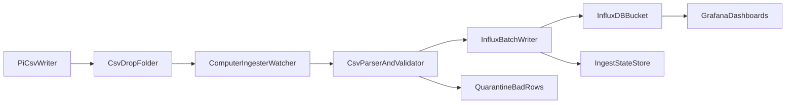

# Architecture v1

## Goal

Provide a reliable ingestion pipeline for sailing telemetry:

`Raspberry Pi CSV files -> Computer ingester -> InfluxDB -> Grafana`

## System Flow

## Components

### Raspberry Pi CSV Producer

- Writes telemetry as append-only CSV files.
- Uses predictable file rotation (for example hourly or daily files).
- Ensures files are closed/rotated cleanly so the ingester can process stable data.

### Computer Ingester

- Watches the CSV input directory.
- Reads only new bytes/rows from each file based on stored checkpoint.
- Validates row format and required fields.
- Converts rows to InfluxDB points and writes in batches.
- Sends malformed rows to quarantine output without stopping healthy ingestion.

### InfluxDB

- Stores GPS telemetry as time-series points.
- Powers Grafana dashboards and time-range queries.

## CSV Contract (v1)

Required columns:

- `timestamp_utc`
- `device_id`
- `lat`
- `lon`
- `speed_kn`
- `heading_deg`

Optional columns:

- `alt_m`
- `sats_used`
- `hdop`
- `fix_quality`

Rules:

- `timestamp_utc` is ISO-8601 UTC.
- `lat` and `lon` are signed decimal degrees (`+/-`).
  - `lat > 0` North, `lat < 0` South
  - `lon > 0` East, `lon < 0` West
- Numeric parse failures quarantine the row; they do not fail the entire file.
- Optional source columns `lat_dir`/`lon_dir` (`N/S`, `E/W`) may be included.

## InfluxDB Data Model (v1)

- Measurement: `telemetry_gps`
- Tags (low-cardinality): `vessel`, `device_id`, `source`
- Fields: `lat`, `lon`, `speed_kn`, `heading_deg`, `alt_m`, `sats_used`
- Timestamp: source telemetry time in UTC

## Ingestion Lifecycle

1. Ingester scans or watches input directory.
2. For each file, it loads checkpoint (`filename + byte_offset + last_timestamp`).
3. It reads from saved offset onward.
4. It parses and validates rows.
5. Valid rows are written to InfluxDB in batches.
6. Invalid rows are written to quarantine output.
7. On successful write, checkpoint and ingest stats are advanced.

## Reliability Model

- Delivery semantics: at-least-once.
- Resume behavior: checkpoint-based recovery after restart.
- Retry behavior: exponential backoff for write failures.
- Failure isolation: malformed rows quarantined, healthy rows continue.

## Interfaces to Dashboards

Grafana queries InfluxDB directly. Expected dashboard panels include:

- map/track visualization from `lat` and `lon`
- speed and heading time-series
- GPS diagnostics (`sats_used`, `alt_m`, optional quality metrics)
